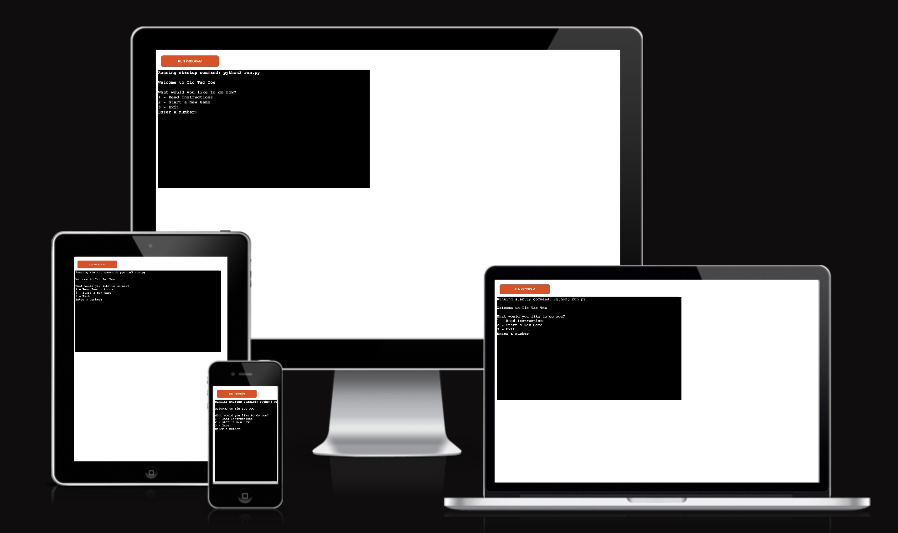

# Portfolio Project 3 - Tic Tac Toe Game

Tic Tac Toe is a classic two-player game implemented in Python. The objective is to be the first to align three of your marks (X or O) in a row, column, or diagonal on a customizable n x n board. The game runs in a terminal and provides an interactive and engaging way for players to compete against each other or the computer. With clear instructions, robust input validation, and a replay option, this game offers a fun and challenging experience for all players.

---

## Live Site

- [You can view the live site here](https://tic-tac-toe-miguel-ad5abe321650.herokuapp.com/)

## Github Repository

- [You can view the Github page here](https://github.com/MiguelMurilloG/tic_tac_toe.git)

---
## Bugs
- Fixed index errors by adjusting for zero indexing.
- Corrected the input validation function structure.

## Remaining Bugs
No known bugs.

## Testing

### PEP8
- No errors were returned from (https://pep8ci.herokuapp.com)

---

## Deployment

The site was deployed to Heroku. Follow these steps to deploy the project:
- Create a new Heroku app.
- Name the app and select the appropriate region.
- Connect the GitHub repository to the Heroku app.
- In the app settings, add the buildpacks for Python and Node.js.
- Deploy the branch. Heroku will build and launch the game.

## Credits
- [Free Code Camp](https://www.freecodecamp.org): The foundational concepts and structure of this game were derived from this course.
- [W3Schools](https://www.w3schools.com):  Offered valuable resources and tutorials on Python
- [Slack Community](https://slack.com/intl/en-gb/): A helpful community for troubleshooting and solving coding challenges.

---

## Acknowledgements

I would like to express my deep appreciation to the following individuals and communities for their invaluable support and contributions throughout the development of the Tic Tac Toe game:

- Sheryl Goldberg: My mentor at Code Institute, whose constructive feedback and guidance were fundamental in shaping this project.
- Code Institute Tutor Team: Their continuous assistance and advice on coding challenges significantly contributed to the project's success.
- Code Institute Slack Community: The collaborative environment and shared expertise within the community were vital in overcoming development hurdles and maintaining motivation.